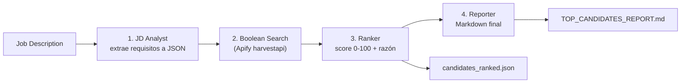

# LinkedIn Candidate Agent

> **Demo técnica.** Automatiza la búsqueda de perfiles públicos de
> LinkedIn a través de un actor de terceros en Apify. El scraping de LinkedIn puede
> infringir sus Términos de Servicio, y los perfiles obtenidos son **datos personales**
> sujetos al RGPD. Quien ejecute este código es el único responsable del uso que le dé,
> de contar con base legal para tratar esos datos y de cumplir la normativa aplicable.

Agente multi-rol con [CrewAI](https://www.crewai.com/) que, dada una **Job Description**, busca candidatos en LinkedIn vía [Apify](https://apify.com/) (`harvestapi/linkedin-profile-search`), los puntúa con un LLM y genera un reporte ejecutivo en Markdown listo para hiring managers.

## Flujo



Si la búsqueda en Apify falla, una **regla inviolable** corta el flujo y deja `Reporte no generado` en lugar de fabricar candidatos.

## Stack

- **CrewAI** + provider Gemini nativo (`crewai.LLM`)
- **Apify Actors Tool** (`crewai_tools`)
- **Google Gemini 2.5 Pro** (configurable a Anthropic Claude)
- `python-dotenv` para gestión de secretos

> **Sobre los extras de `requirements.txt`:** CrewAI publica los providers de LLM y la
> integración de Apify como *extras* opcionales, no como dependencias base. Por eso el
> fichero pide `crewai[google-genai,anthropic]` y `crewai-tools[apify]`: sin ellos la
> instalación parece correcta pero el script falla al arrancar con un `ImportError`
> pidiendo `langchain-apify` o el provider nativo correspondiente.

## Requisitos

- Python 3.12
- Una API key de [Google AI Studio](https://aistudio.google.com/app/apikey) (formato `AIzaSy...`)
- Un token de [Apify](https://console.apify.com/settings/integrations) (formato `apify_api_...`)
- El actor [`harvestapi/linkedin-profile-search`](https://console.apify.com/store/harvestapi/linkedin-profile-search) autorizado en tu cuenta. Coste real observado: ~$0.30-0.50 por búsqueda completa.

## Setup

```bash
git clone <url-del-repo>
cd linkedin-candidate-agent

python -m venv .venv
# Windows:
.\.venv\Scripts\Activate.ps1
# macOS/Linux:
# source .venv/bin/activate

pip install -r requirements.txt

cp .env.example .env
# Edita .env y rellena GOOGLE_API_KEY y APIFY_API_TOKEN
```

## Ejecutar

Edita el bloque `job_description` al final de [`linkedin_agent.py`](linkedin_agent.py) con la JD que quieras analizar y lanza:

```bash
python linkedin_agent.py
```

Salidas en la raíz del proyecto:

- `candidates_ranked.json` — lista de candidatos con score y razonamiento.
- `TOP_CANDIDATES_REPORT.md` — reporte ejecutivo con Top 10 + mensajes de outreach personalizados.

## Cambiar de proveedor LLM

En [`linkedin_agent.py`](linkedin_agent.py) cambia la primera constante:

```python
LLM_PROVIDER = "gemini"  # o "claude"
```

Si eliges `claude`, asegúrate de tener `ANTHROPIC_API_KEY` en `.env`.

## Estructura

```
linkedin-candidate-agent/
├── linkedin_agent.py       # Crew, agentes, tareas y entrypoint
├── requirements.txt
├── .env.example            # Plantilla; copiar a .env y rellenar
├── .gitignore              # Ignora .env, .venv/ y outputs con datos personales
├── LICENSE                 # MIT
└── README.md
```

## Notas de privacidad

Los archivos `TOP_CANDIDATES_REPORT.md` y `candidates_ranked.json` contienen **datos personales reales** scrapeados de LinkedIn (nombres, URLs, experiencia). Están en `.gitignore` deliberadamente para no incluirlos en el repo.

## Licencia

Distribuido bajo licencia [MIT](LICENSE). Se entrega "tal cual", sin garantías.
